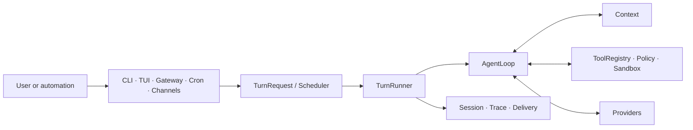

<div align="center">

# X-harness

### A compact runtime for tool-using agents across local and asynchronous surfaces.


[Quick Start](#quick-start) · [Evaluation](#evaluation) ·
[First-use guide](docs/onboarding/README.zh-CN.md) · [中文](README.zh-CN.md)

</div>

## The problem

Agent entry points often grow separate execution loops, state handling, and safety
rules. That makes terminal sessions, background jobs, and message channels behave
differently and makes outcomes difficult to reproduce.

X-harness is a secondary-development fork of the original Pico project. It
routes those entry points through one Turn runtime. The runtime owns
scheduling, context assembly, tool execution, session persistence, tracing, and
delivery bookkeeping. CLI and TUI are the primary interactive surfaces;
Gateway and channels are asynchronous control surfaces.

## Architecture



Conversation ordering belongs to the Scheduler. Session, temporary Context,
Workspace checkpoints, runtime recovery state, traces, delivery state, and
external side effects remain separate domains. A completed Turn therefore does
not imply successful delivery or prove that an external side effect occurred.

## Core Features

| Capability | Status | What is implemented |
| --- | --- | --- |
| Unified Turn path | Core | CLI, TUI, Gateway, Cron, and channels converge on the same scheduling and execution path. |
| Scheduling and cancellation | Core | Per-conversation ordering, busy-policy handling, origin capacity, cancellation, and terminal events. |
| Sessions and context | Core | Persisted conversations plus bounded, model-visible context assembly. Resume starts a new Turn from persisted facts. |
| Tool execution | Core | Registry lookup, argument validation, policy checks, timeouts, concurrency controls, and sandbox integration remain runtime-owned. |
| Selective rewind | Experimental | Branch-preserving conversation, Workspace, or combined rewind. It does not revive processes, streams, or Python stacks. |
| Progressive tool disclosure | Experimental | Tool search limits schemas shown to the model; `ToolRegistry` remains the executable source of truth. |
| Trace replay and verification | Experimental | Replay is non-destructive by default, and verification runs outside the evaluated agent. |
| Gateway and channels | Partial | Asynchronous status, instruction, cancellation, and result-delivery paths exist; live provider/channel setup still needs environment-specific validation. |
| Memory backends | Partial | A backend contract exists, but this repository does not bundle an external Memory implementation. |
| Evolver and Jev decision components | Experimental | Opt-in candidate evaluation with deterministic fallback and manual activation. These components cannot authorize tools or own terminal state. |

## Execution Flow

1. A surface creates a `TurnRequest`.
2. The Scheduler applies conversation ordering, capacity, and cancellation rules.
3. The Turn runner assembles Context from persisted facts and current inputs.
4. The model proposes responses or tool calls.
5. The deterministic runtime validates and executes allowed tools.
6. Session facts, traces, runtime evidence, and delivery state are recorded by
   their respective owners.
7. Evaluation uses predefined verifiers; the model's final message is not proof
   of success.

## Quick Start

X-harness requires Python 3.12 and [uv](https://docs.astral.sh/uv/). The current
Python distribution and CLI retain their upstream-compatible names,
`pico-harness` and `pico`. From a checkout:

```bash
uv sync --frozen --extra dev --dev
uv run pico onboard --skip-memory
uv run pico run -m "Map the main request path in this repository"
uv run pico doctor --probe
```

`doctor --probe` makes a real provider request and may consume provider quota.
Without the probe, configuration validation does not prove that a provider can
return a response.

The native TUI additionally requires Node.js 22 and its checked-in lockfiles:

```bash
npm ci
npm ci --prefix ui-tui
uv run pico --dev
```

For onboarding, provider configuration, and recovery guidance, see the
[first-use guide](docs/onboarding/README.zh-CN.md). Feishu setup is documented
separately in the [channel guide](docs/onboarding/feishu.zh-CN.md).

## Evaluation

The included PicoBench framework contains deterministic fixtures, workload definitions, reducers, and
verifiers. Published measurements are valid only for the named frozen workload,
environment, and verifier; they are not production service-level claims.

```bash
python scripts/run_tests.py fast --suite p0_core
python scripts/run_tests.py phase --phase p1c
make picobench-smoke
```

The [evaluation index](docs/evaluation/README.md) links the retained reports and
their evidence boundaries. This README intentionally presents no benchmark
number without an accompanying run artifact.

## Current Limitations / Roadmap

- The project is alpha and public interfaces may change before 1.0.
- Provider, sandbox, and channel behavior depends on local configuration; the
  deterministic suite does not replace live smoke testing.
- Resume reconstructs work from durable evidence. It does not resume an old
  coroutine, subprocess, provider stream, lock, or program counter.
- Delivery recovery is separate from Turn execution and must not rerun a Turn
  merely because delivery failed.
- Selective rewind, progressive disclosure, trace replay, independent
  verification, knowledge evolution, and Jev remain experimental.
- Jev is disabled by default and is limited to ranking or recommendation. The
  deterministic runtime retains permission, safety, activation, and terminal
  authority.

The development order is deterministic baseline → selective rewind → tool
progressive disclosure → trace replay and independent verification → optional
decision-plane experiments.

## Release and security boundary

Repository checks reject internal planning documents, raw benchmark outputs,
credential-bearing files, and known private-environment references. Runtime
state normally lives under `~/.pico`, outside the current repository. Never add
real credentials to examples, fixtures, issue reports, or benchmark artifacts.

## Development

```bash
python scripts/run_tests.py fast --suite test_infrastructure
make check-public-tree
git diff --check
```

Use the canonical test runner for broader phase or release acceptance. Release
checks are deterministic, but they cannot certify an untested external provider
or channel.

## License

Apache License 2.0. See [LICENSE](LICENSE), [NOTICES.md](NOTICES.md), and
[LICENSES/](LICENSES/) for attribution.
