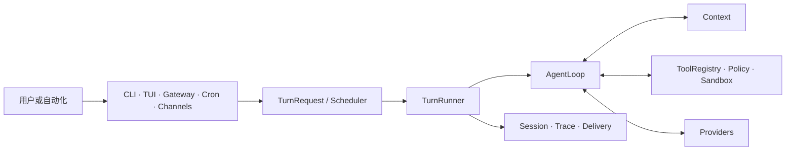

<div align="center">

# X-harness

### 面向本地与异步入口的紧凑型工具调用 Agent Runtime。


[快速开始](#快速开始) · [评测](#评测) ·
[首次使用指南](docs/onboarding/README.zh-CN.md) · [English](README.md)

</div>

## 项目解决的问题

Agent 的不同入口很容易各自发展出独立的执行循环、状态处理和安全规则，导致终端、
后台任务与消息渠道行为不一致，结果也难以复现。

X-harness 是基于初始开源项目 Pico 的二次开发项目。它让这些入口统一提交 Turn，
由同一套 Runtime 负责调度、Context 组装、工具执行、
Session 持久化、Tracing 与投递记录。CLI/TUI 是主要交互界面；Gateway 与消息渠道是
异步控制面。

## Architecture



Scheduler 负责会话级顺序。Session、临时 Context、Workspace Checkpoint、Runtime
恢复状态、Trace、Delivery 和外部副作用仍是不同状态域。因此 Turn 完成不等于投递
成功，也不能证明外部副作用已经发生。

## Core Features

| 能力 | 状态 | 当前实现 |
| --- | --- | --- |
| 统一 Turn 路径 | Core | CLI、TUI、Gateway、Cron 和 Channels 汇入同一套调度与执行路径。 |
| 调度与取消 | Core | 会话级顺序、Busy Policy、入口容量、取消与终态事件。 |
| Session 与 Context | Core | 持久化对话与受预算约束的模型可见 Context；Resume 基于已持久化事实启动新 Turn。 |
| 工具执行 | Core | Registry 查询、参数校验、策略检查、超时、并发规则与 Sandbox 由 Runtime 决定。 |
| Selective Rewind | Experimental | 可保留分支地回退对话、Workspace 或二者；不会恢复进程、流或 Python 调用栈。 |
| 工具渐进披露 | Experimental | Tool Search 只控制向模型展示的 Schema；`ToolRegistry` 仍是可执行工具的事实源。 |
| Trace Replay 与验证 | Experimental | Replay 默认不产生副作用，验证逻辑位于被评测 Agent 之外。 |
| Gateway 与 Channels | Partial | 已有异步状态、补充指令、取消和结果投递路径；真实 Provider/渠道仍需环境验证。 |
| Memory Backend | Partial | 已有 Backend 契约，但仓库不附带外部 Memory 实现。 |
| Evolver 与 Jev | Experimental | 仅按需启用候选评测，带确定性回退和人工激活；不能授权工具或决定终态。 |

## Execution Flow

1. 入口创建 `TurnRequest`。
2. Scheduler 应用会话顺序、容量和取消规则。
3. Turn Runner 从持久化事实和当前输入组装 Context。
4. 模型提出回复或工具调用。
5. 确定性 Runtime 校验并执行获准工具。
6. Session 事实、Trace、Runtime 证据与 Delivery 状态由各自组件记录。
7. Evaluation 使用预定义 Verifier；模型的最终回复不是成功证明。

## 快速开始

X-harness 需要 Python 3.12 和 [uv](https://docs.astral.sh/uv/)。当前 Python 分发名和
CLI 命令为保持代码兼容，仍分别使用 `pico-harness` 与 `pico`。在已克隆的仓库中：

```bash
uv sync --frozen --extra dev --dev
uv run pico onboard --skip-memory
uv run pico run -m "说明这个仓库的主请求路径"
uv run pico doctor --probe
```

`doctor --probe` 会发起真实 Provider 请求，并可能消耗配额。未执行 Probe 时，配置校验
通过不能证明 Provider 能返回回复。

原生 TUI 还需要 Node.js 22，并使用仓库中的锁文件安装依赖：

```bash
npm ci
npm ci --prefix ui-tui
uv run pico --dev
```

Onboarding、Provider 配置与恢复说明见[首次使用指南](docs/onboarding/README.zh-CN.md)；
飞书设置见独立的[渠道指南](docs/onboarding/feishu.zh-CN.md)。

## 评测

仓库内的 PicoBench 包含确定性 Fixture、Workload、Reducer 和 Verifier。公开测量结果只适用于
明确命名的冻结 Workload、环境和 Verifier，不能作为生产 SLA。

```bash
python scripts/run_tests.py fast --suite p0_core
python scripts/run_tests.py phase --phase p1c
make picobench-smoke
```

[评测索引](docs/evaluation/README.md)列出保留的报告及其证据边界。首页不会展示缺少
运行工件支撑的 Benchmark 数字。

## Current Limitations / Roadmap

- 项目处于 Alpha 阶段，1.0 前公开接口可能变化。
- Provider、Sandbox 与渠道行为依赖本地配置；确定性测试不能替代真实 Smoke Test。
- Resume 根据持久化证据重新开始工作，不会恢复旧 Coroutine、子进程、Provider
  Stream、锁或程序计数器。
- Delivery 恢复独立于 Turn 执行，不能因为投递失败而自动重跑 Turn。
- Selective Rewind、工具渐进披露、Trace Replay、独立验证、知识演进与 Jev 仍是
  Experimental。
- Jev 默认关闭，只能排序或推荐；权限、安全、激活和终态始终由确定性 Runtime 决定。

当前开发顺序是：确定性基线 → Selective Rewind → 工具渐进披露 → Trace Replay 与
独立验证 → 可选决策平面实验。

## 发布与安全边界

仓库检查会拒绝内部计划、原始 Benchmark 输出、凭据文件和已知私有环境引用。Runtime
状态通常位于仓库外的 `~/.pico`。不要把真实凭据写入示例、Fixture、Issue 或评测工件。

## 开发验证

```bash
python scripts/run_tests.py fast --suite test_infrastructure
make check-public-tree
git diff --check
```

更广的阶段或发布验收应使用规范测试运行器。发布检查是确定性的，但不能证明未测试的
外部 Provider 或渠道可用。

## 许可证

使用 Apache License 2.0。第三方归属见 [LICENSE](LICENSE)、[NOTICES.md](NOTICES.md)
和 [LICENSES/](LICENSES/)。
